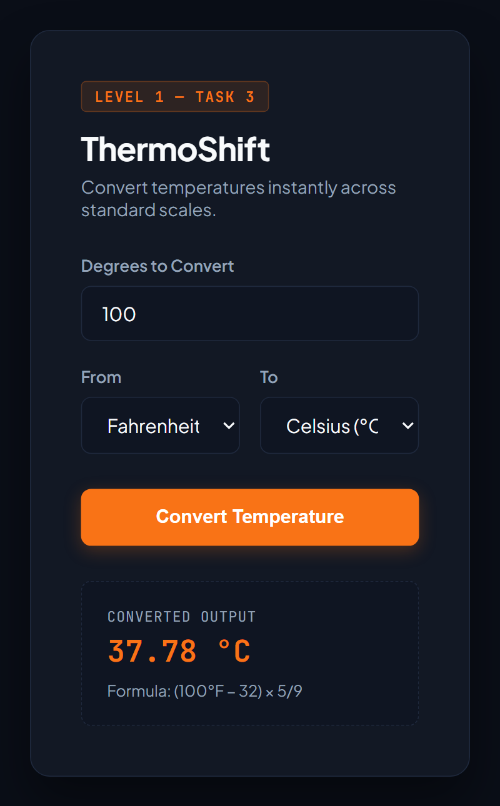

# Temperature Converter Website (Task 3)

An interactive, responsive temperature converter supporting conversions across Celsius, Fahrenheit, and Kelvin with formula annotations built for the **Oasis Infobyte Internship Program (OIBSIP)**.

## 🚀 Features
- **Bidirectional Unit Conversions:** Instant conversion between Celsius (°C), Fahrenheit (°F), and Kelvin (K).
- **Formula Breakdown:** Displays calculation formulas dynamically upon conversion.
- **Input Validation:** Handles decimal entries and checks against invalid empty submissions.
- **Responsive Card UI:** Dark-mode design structured with CSS Flexbox.

## 🛠 Tech Stack
- **HTML5** (Form controls and semantic layout)
- **CSS3** (Custom properties, transitions, responsive card styling)
- **JavaScript** (Mathematical conversion logic and DOM manipulation)

## 📸 Screenshots
### Desktop View

### Mobile View
